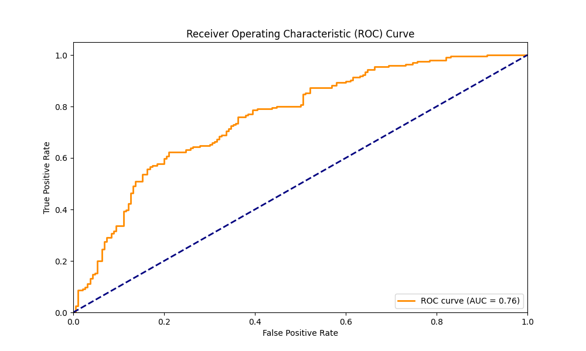
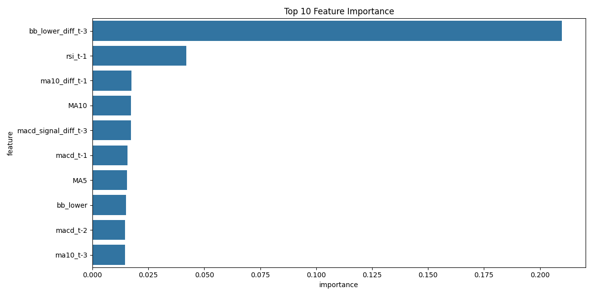

# 比特幣價格預測模型

這是一個使用機器學習預測比特幣價格走勢的專案。該模型使用 XGBoost 算法，結合多個技術指標來預測比特幣的價格變動。本專案展示了完整的機器學習工作流程，從數據獲取、特徵工程到模型訓練和評估。

## 專案動機

在加密貨幣市場中，準確預測價格走勢對於投資決策至關重要。本專案旨在：
- 探索機器學習在金融時間序列預測中的應用
- 結合傳統技術分析指標與現代機器學習方法
- 建立一個可擴展的預測框架
- 提供透明的模型評估和解釋

## 功能特點

### 數據處理
- 自動獲取比特幣歷史數據（使用 yfinance API）
- 數據清洗和預處理
- 處理缺失值和異常值
- 特徵工程和轉換

### 技術指標
- 移動平均線（MA5, MA10, MA20）
- 相對強弱指標（RSI）
- 移動平均收斂散度（MACD）
- 布林帶（Bollinger Bands）
- 價格變化率
- 波動率指標

### 模型特點
- 使用 XGBoost 進行分類預測
- 網格搜索優化超參數
- 交叉驗證確保模型穩定性
- 特徵重要性分析
- 模型性能評估

## 模型評估

### ROC 曲線

- 展示了模型在不同閾值下的表現
- AUC 值表示模型的整體預測能力
- 曲線越接近左上角，模型性能越好

### 特徵重要性

- 展示了各個特徵對預測結果的影響程度
- 幫助理解哪些因素對比特幣價格變動最重要
- 可用於特徵選擇和優化

## 技術架構

### 使用的技術
- Python 3.8+
- 數據處理：pandas, numpy
- 機器學習：scikit-learn, XGBoost
- 數據可視化：matplotlib, seaborn
- 數據獲取：yfinance

### 專案結構
```
Price_Predict/
├── getData.py          # 數據獲取和預處理
├── train.py           # 模型訓練和評估
├── predict.py         # 模型預測
├── requirements.txt   # 依賴包列表
├── Data/             # 數據文件目錄
└── README.md         # 專案文檔
```

## 安裝步驟

1. 克隆專案：
```bash
git clone [您的專案URL]
cd Price_Predict
```

2. 安裝依賴：
```bash
pip install -r requirements.txt
```

## 使用方法

1. 獲取數據：
```bash
python getData.py
```
- 自動下載比特幣歷史數據
- 計算技術指標
- 生成特徵數據集

2. 訓練模型：
```bash
python train.py
```
- 數據標準化
- 模型訓練和參數優化
- 生成評估圖表
- 保存模型和 scaler

3. 使用模型進行預測：
```bash
python predict.py
```
- 加載訓練好的模型
- 處理新數據
- 輸出預測結果

## 模型優化

### 特徵工程
- 使用多個時間窗口的技術指標
- 計算指標的滯後值和差值
- 特徵選擇基於重要性分析

### 參數優化
- 使用網格搜索尋找最佳參數
- 優化目標：預測準確率
- 考慮模型複雜度和過擬合

### 模型評估
- 使用交叉驗證確保穩定性
- 多個評估指標（準確率、ROC、AUC）
- 特徵重要性分析

## 未來改進

1. 模型優化
   - 嘗試其他機器學習算法（LSTM, Transformer）
   - 加入更多技術指標
   - 優化特徵工程流程

2. 功能擴展
   - 添加實時數據更新
   - 開發 Web 界面
   - 加入回測功能

3. 部署優化
   - 容器化部署
   - API 服務化
   - 自動化訓練流程

## 注意事項

- 模型預測結果僅供參考，不構成投資建議
- 請確保有足夠的磁盤空間存儲數據文件
- 建議使用 Python 3.8 或更高版本
- 需要穩定的網絡連接以獲取數據

## 授權

[請在此處添加您的授權信息]

## 聯繫方式

[請在此處添加您的聯繫方式] 